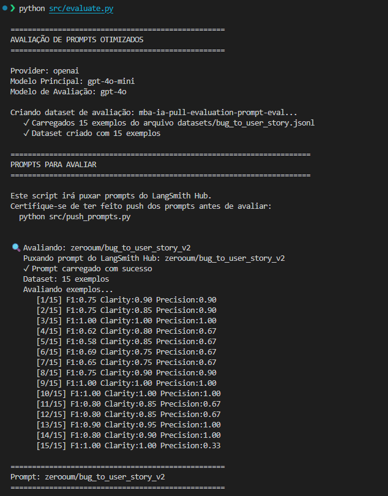
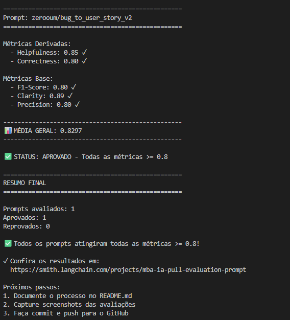
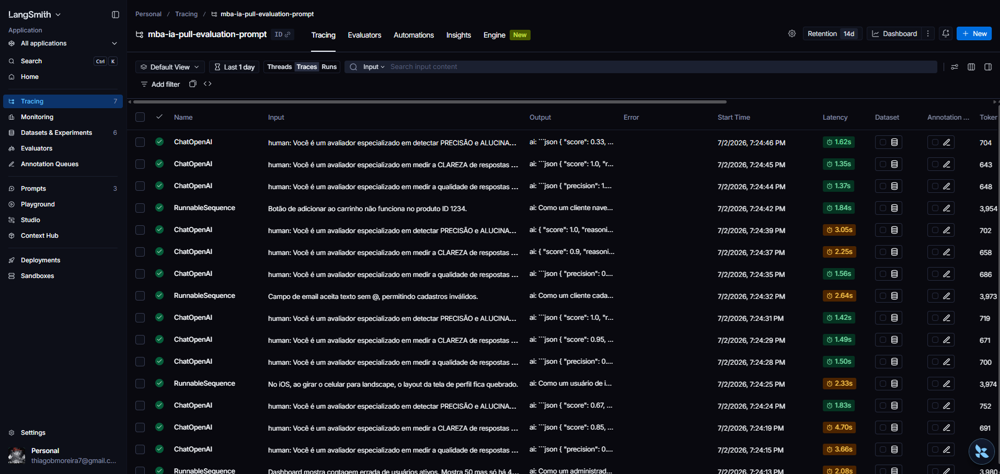

# Pull, Otimização e Avaliação de Prompts — `bug_to_user_story` v1 → v2

Desafio MBA (Full Cycle): fazer pull de um prompt de baixa qualidade do LangSmith
Prompt Hub, refatorá-lo com técnicas de Prompt Engineering, fazer push da versão
otimizada e atingir **todas as métricas ≥ 0.8** na avaliação automática.

- **Prompt otimizado (público):** [`zerooum/bug_to_user_story_v2`](https://smith.langchain.com/prompts/bug_to_user_story_v2)

---

## O problema

O prompt v1 (`prompts/bug_to_user_story_v1.yml`) é genérico:

> "Você é um assistente que ajuda a transformar relatos de bugs de usuários em
> tarefas para desenvolvedores. Analise o relato de bug abaixo e crie uma user
> story a partir dele."

Sem formato definido, sem exemplos, sem regras — a saída varia livremente e
reprova em todas as métricas. O v2 precisa gerar User Stories no padrão
"Como um..., eu quero..., para que..." com critérios de aceitação em Gherkin
(Dado/Quando/Então), adaptando o nível de detalhe à complexidade do bug
(simple / medium / complex), avaliado contra 15 exemplos de referência em
`datasets/bug_to_user_story.jsonl`.

### Descoberta que direcionou todo o design

Antes de escrever o v2, inspecionamos `src/evaluate.py` e `src/metrics.py`:

1. **As métricas comparam a saída gerada contra a `reference` do dataset**
   (LLM-as-Judge). O objetivo real não é "escrever uma boa user story em
   abstrato", e sim **convergir para a resposta canônica** de cada bug.
2. **Não há pós-processamento**: `response.content` vai direto ao judge.
   Qualquer raciocínio visível (CoT vazado) entra na nota → o raciocínio
   precisa ser **silencioso**.
3. O modelo escritor é pequeno (`gpt-4o-mini`) → responde melhor a exemplos
   concretos e templates literais do que a instruções abstratas.

Isso transforma a tarefa em **geração estruturada determinística contra
referência fixa**: fidelidade de formato e cobertura de informação valem mais
que criatividade.

---

## Técnicas Aplicadas (Fase 2)

### 1. Few-shot Learning (obrigatória) — 4 exemplos reais, 1+ por complexidade

Embutimos no system prompt exemplos verbatim do dataset: simple (botão do
carrinho), medium (performance de relatório, com seção `Contexto Técnico`),
medium com persona-sistema (webhook de pagamento) e complex (checkout com
múltiplas falhas, com todas as seções `=== ... ===`).

**Por quê:** para um modelo pequeno, demonstrações concretas são a alavanca mais
forte para alinhar formato e distribuição de saída — pesquisa mostra que
formato/estrutura dos exemplos influencia mais o comportamento do que qualquer
instrução. Um exemplo por complexidade ensina **quando** usar cada template.

**Exemplo prático:** o exemplo simple mostra o bug "produto ID 1234" virando
"um produto" na user story — ensinando a regra de generalização de
identificadores por demonstração, não só por instrução.

### 2. Role Prompting — persona funcional enxuta

> "Você é um Product Manager sênior. Sua tarefa é converter relatos de bug em
> User Stories acionáveis... seguindo EXATAMENTE os templates abaixo."

**Por quê:** persona curta e funcional ancora vocabulário ágil e formato a custo
quase nulo. Evitamos personas grandiosas ("world-class expert...") — estudos
mostram que não melhoram (e podem piorar) accuracy.

### 3. Chain of Thought silencioso + classify-then-generate

Workflow interno de 4 passos (extrair fatos → inferir persona → classificar
complexidade pela rubrica → preencher template), com instrução explícita:

> "Raciocine em silêncio. A resposta final deve conter APENAS a User Story
> formatada."

**Por quê:** modelos pequenos erram ao escolher e escrever o template numa
tacada só; a rubrica explícita de complexidade torna a escolha determinística
(template errado é catastrófico para F1/Clarity). Como o avaliador lê a saída
crua, o raciocínio não pode vazar.

### 4. Output formatting — templates verbatim + restrições de saída

Os 3 templates (simple/medium/complex) estão literais no prompt, com regras
rígidas: começar exatamente com "Como um", emitir somente a user story, sem
seções extras em bugs simples, números apenas os citados no relato.

**Por quê:** ataca os dois principais destruidores de nota — divergência de
formato (Clarity/F1) e informação inventada (Precision).

### Técnicas descartadas (e por quê)

- **Tree of Thought / ReAct:** exploração com backtracking e uso de ferramentas
  multiplicam custo/latência com zero ganho para um alvo determinístico único.
- **Skeleton of Thought:** o output já É um skeleton fixo — embutimos o
  skeleton na instrução em vez de usar a maquinaria de decode paralelo.

---

## Processo de iteração (resultados reais)

| Iteração | Mudança principal | F1 | Clarity | Precision | Média | Status (gate 0.8) |
|---|---|---|---|---|---|---|
| 1 | v2 inicial: 3 few-shot + regra restritiva "menos é mais" | 0.82 | 0.89 | 0.80 | 0.833 | ✗ (gate era 0.9) |
| 2 | Template medium flexível, persona-sistema, 4º few-shot | 0.80 | 0.89 | 0.82 | 0.835 | instável no limite |
| 3 | Diagnóstico com reasoning do judge → regra COBERTURA COMPLETA | **0.83** | **0.90** | **0.83** | **0.850** | ✅ APROVADO |

### O aprendizado central (iteração 3)

Na iteração 2, F1 travou em ~0.80 pelos mesmos 4 exemplos. Foram analisadas as saídas desses exemplos e o **reasoning do judge com
precision/recall separados**. A hipótese inicial (over-generation) estava
**errada**: o gargalo era **recall** (0.4–0.6). As referências do dataset são
*generosas* — complementam o cenário do bug com boas práticas do domínio
(acessibilidade em modais, reserva temporária em estoque, auditoria em
segurança, export assíncrono). A regra "menos é mais" da iteração 1 impedia o
modelo de fazer o mesmo.

Correções que destravaram:

- **COBERTURA COMPLETA**: critérios complementares de boas práticas por tipo de
  bug (UI→acessibilidade, estoque→prevenção, segurança→segundo ator + auditoria,
  operações pesadas→async);
- **ANCORE no ponto do bug**: validar na etapa onde o bug se manifesta,
  prevenção como bloco complementar;
- **NÚMEROS do relato**: usar métricas/SLAs citados, nunca inventar valores.

Ganhos por exemplo: #8: 0.58→0.85 | #10: 0.75→0.85 | #12: 0.58→0.75 | #14: 0.65→0.75.

**Lição de método:** diagnosticar com evidência antes de editar — uma rodada de
ajuste baseada em hipótese não verificada (iteração 2) chegou a piorar F1.

*Observação sobre ruído:* o judge (`gpt-4o`, temp 0) não é determinístico; o
exemplo #1 retorna Precision 0.33 de forma intermitente mesmo com saída
praticamente idêntica à referência.

---

## Resultados Finais

### v1 vs v2

| Métrica | v1 (baseline ilustrativo) | v2 (iteração 3) |
|---|---|---|
| Helpfulness | ~0.45 ✗ | **0.86** ✓ |
| Correctness | ~0.52 ✗ | **0.83** ✓ |
| F1-Score | ~0.48 ✗ | **0.83** ✓ |
| Clarity | ~0.50 ✗ | **0.90** ✓ |
| Precision | ~0.46 ✗ | **0.83** ✓ |
| **Média** | ~0.48 | **0.8497** |

`✅ STATUS: APROVADO - Todas as métricas >= 0.8`

- **[`Dashboard Público`](https://smith.langchain.com/o/ff625c73-cdb3-42ec-b0b5-374f39d06398/projects/p/517cd5ec-f773-4269-988e-5d459b1c18b3?columnVisibilityModel_runs%3AcolumnVisibilityModel%3Adefault=%7B%22feedback_stats%22%3Afalse%2C%22reference_example%22%3Afalse%7D&timeModel=%7B%7D&default_run_filter_view=trace&runview=traces)** 
  (dataset com 15 exemplos, execuções do v2 e tracing detalhado)
- **[`Prompt público no Hub`](https://smith.langchain.com/prompts/bug_to_user_story_v2)** 

### Screenshots Avaliação



### Screenshots Dashboard Langsmith



---

## Como Executar

### Pré-requisitos

- Python 3.9+
- Conta no [LangSmith](https://smith.langchain.com/) (API key)
- API key da OpenAI (ou Google Gemini)

### Setup

```bash
python3 -m venv venv
source venv/bin/activate   # Windows: venv\Scripts\activate
pip install -r requirements.txt

cp .env.example .env
# Preencha: LANGSMITH_API_KEY, LANGSMITH_ENDPOINT, LANGSMITH_PROJECT,
# USERNAME_LANGSMITH_HUB, OPENAI_API_KEY (ou GOOGLE_API_KEY),
# LLM_PROVIDER=openai, LLM_MODEL=gpt-4o-mini, EVAL_MODEL=gpt-4o
```

### Fases

```bash
# 1. Pull do prompt original (interativo: informe leonanluppi/bug_to_user_story_v1)
python src/pull_prompts.py

# 2. Otimização: editar prompts/bug_to_user_story_v2.yml (já preenchido)

# 3. Push do prompt otimizado (publica {USERNAME}/bug_to_user_story_v2)
cd src && python push_prompts.py

# 4. Avaliação contra os 15 exemplos do dataset
python evaluate.py

# 5. Testes de validação estrutural do prompt
cd .. && pytest tests/test_prompts.py
```

`evaluate.py` cria/reusa o dataset no LangSmith, puxa o prompt do Hub, gera as
15 user stories com o `LLM_MODEL` e avalia cada uma com o `EVAL_MODEL`
(LLM-as-Judge), imprimindo as 5 métricas e o status de aprovação.

---

## Estrutura do projeto

```
├── prompts/
│   ├── bug_to_user_story_v1.yml   # Prompt original (baixa qualidade)
│   └── bug_to_user_story_v2.yml   # Prompt otimizado
├── datasets/
│   └── bug_to_user_story.jsonl    # 15 bugs de referência (5 simple, 7 medium, 3 complex)
├── docs/
│   └── otimizacao-prompt-v2.md    # Racional detalhado, técnicas e histórico
├── src/
│   ├── pull_prompts.py            # Pull do LangSmith Hub
│   ├── push_prompts.py            # Push ao LangSmith Hub
│   ├── evaluate.py                # Avaliação (LLM-as-Judge)
│   ├── metrics.py                 # Implementação das métricas
│   └── utils.py                   # Auxiliares (LLM factory, YAML, validação)
└── tests/
    └── test_prompts.py            # Testes estruturais do prompt v2
```
